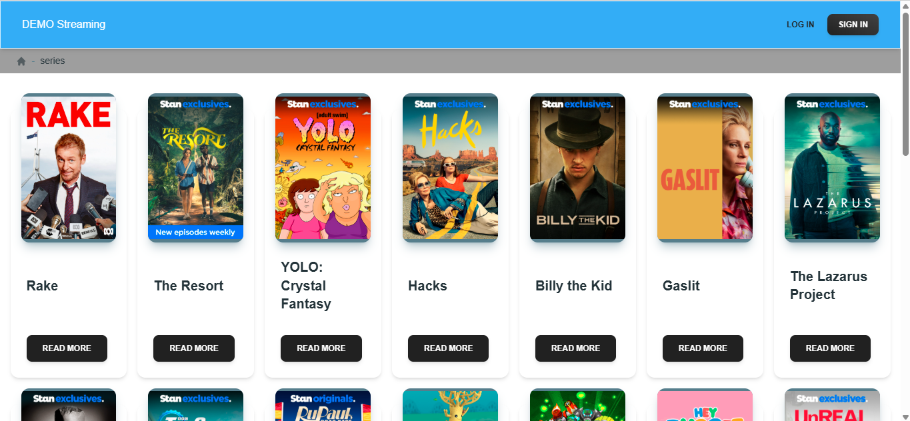
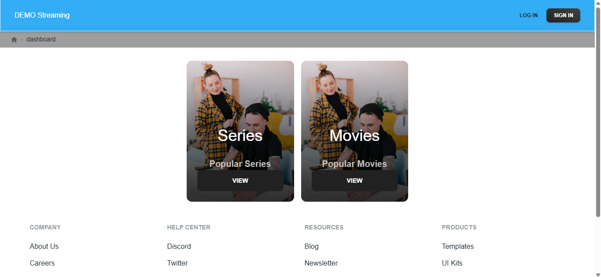

# prueba tecnica
Para resaltar que el repositorio brindado con el archivo "data.json" estaba erroneo las URLS de las imagenes por lo que decidi copiar el contenido del api "data.json" de la url brindada https://raw.githubusercontent.com/StreamCo/react-coding-challenge/master/feed/sample.json.

## ¿Cómo decidió las opciones técnicas y arquitectónicas utilizadas como parte de su solución?
Utilice el template de inicializacion React + TypeScript + Vite para agilizar el desarrollo, a demas que ya e trabajado antes con ello. El uso de componentes y el tipado de typescript facilita tambien el desarrollo y las buenas practicas

## ¿Hay alguna mejora que pueda hacer en su envío?
Mejoraria los estilos y el diseño en general, ya que al hacer la prueba lo mas rapido posible, no pude implementar mas UI y UX.

## ¿Qué haría de manera diferente si se le asignara más tiempo?
Utilizaria el paginado, mejoraria el footer, el enrutamiento en los layouts, las migas de pan, etc.

Este proyecto se inició con [yarn create vite](https://vitejs.dev/guide/).

## Scripts disponibles

En el directorio del proyecto, puedes ejecutar:

### `yarn install`

Se utiliza para instalar todas las dependencias de este proyecto.

### `yarn dev`

Ejecuta la aplicación en modo de desarrollo.\
Abre [http://localhost:<port>](http://localhost:<port>) para verla en tu navegador.

La página se recargará al realizar cambios.\
También puedes ver errores de lint en la consola.

### `yarn build`

Compila la aplicación para producción en la carpeta `build`.\
Empaqueta React correctamente en modo de producción y optimiza la compilación para obtener el mejor rendimiento.

La compilación se minimiza y los nombres de archivo incluyen los hashes.\
¡Tu aplicación está lista para implementarse!

Consulta la sección sobre [implementación](https://facebook.github.io/create-react-app/docs/deployment) para obtener más información.

## Tecnología utilizada en este proyecto

- https://reactrouter.com/
- https://github.com/creativetimofficial/material-tailwind
- https://create-react-app.dev/docs/adding-a-sass-stylesheet
- https://github.com/tailwindlabs/heroicons
- https://www.material-tailwind.com/
- https://tailwindcss.com/

# React + TypeScript + Vite

Esta plantilla proporciona una configuración básica para que React funcione en Vite con HMR y algunas reglas de ESLint.

Actualmente, hay dos plugins oficiales disponibles:

- [@vitejs/plugin-react](https://github.com/vitejs/vite-plugin-react/blob/main/packages/plugin-react) usa [Babel](https://babeljs.io/) para la actualización rápida.
- [@vitejs/plugin-react-swc](https://github.com/vitejs/vite-plugin-react/blob/main/packages/plugin-react-swc) usa [SWC](https://swc.rs/) para la actualización rápida.